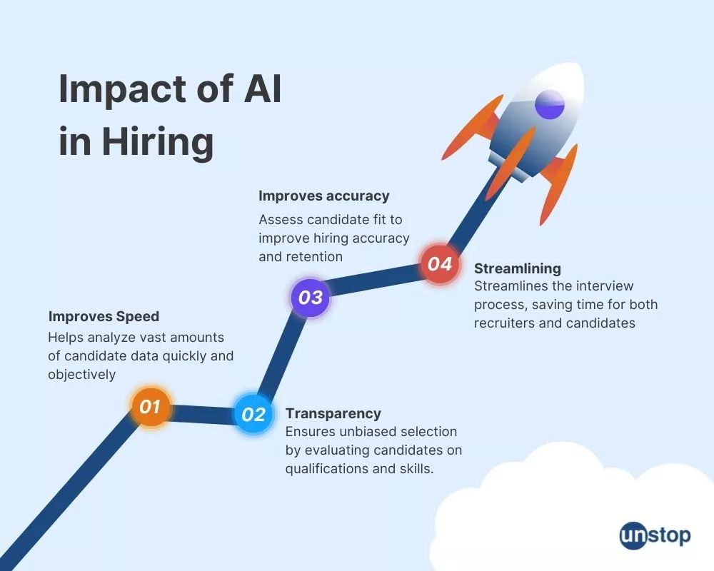
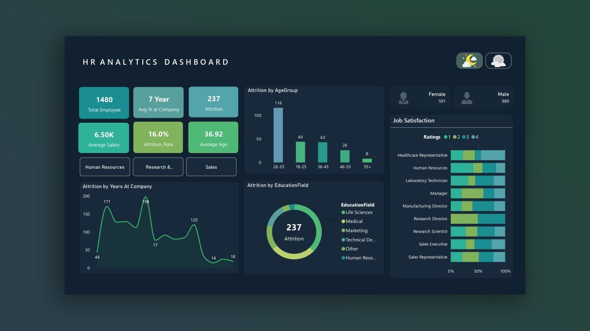
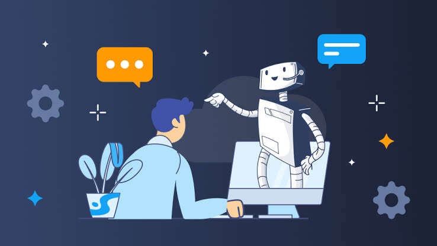

> <!--
author: Kainat Asif
email: kainatasif9087@gmail.com
version: 1.0
language: en
-->

# AI in Industry and Professional HR

> 30-Minute Workshop for TVET

---

## Learning Objectives

By the end of this workshop participants will be able to:

- Define Artificial Intelligence (AI)
- Explain AI applications in HR
- Apply AI tools in recruitment and training
- Evaluate benefits and challenges of AI in HR

---

## Ice Breaker Activity

### Question

Where do you think AI is most useful in Human Resource Management?

- Recruitment
- Employee Training
- Performance Evaluation
- Workforce Planning

Ask participants to vote for one option and briefly explain their choice.

## What is Artificial Intelligence?

Artificial Intelligence (AI) refers to technologies that enable machines to perform tasks that normally require human intelligence.

Examples:

- Learning
- Problem Solving
- Decision Making

---

## What is Human Resource Management?

Human Resource Management (HRM) is responsible for:

- Recruitment
- Training
- Employee Development
- Performance Management

---

## AI Applications in HR
### AI Recruitment

### HR Analytics Dashboard

### Employee Onboarding Chatbot

### Workforce Planning

### Recruitment

AI screens resumes automatically.

### Training

AI recommends personalized learning paths.

### Employee Support

AI chatbots answer employee questions.

### Workforce Analytics

AI predicts workforce needs.

---

## Industry Example

### Scenario

A manufacturing company receives 1000 applications for 10 technician positions.

Traditional Method:

- 2 weeks screening

AI Method:

- 2 hours screening

### Discussion

Which method is more efficient and why?

---

## Video Activity

Watch a short video about AI in HR.

Watch the following video:

https://www.youtube.com/watch?v=1vkb7BCMQd0

### Discussion Questions

1. What AI applications did you observe?
2. How can AI improve recruitment?
3. What are the ethical concerns of AI in HR?

---

## Hands-on Activity

Open ChatGPT and enter:

Write a job description for an HR Manager in a manufacturing company.

Discuss the output.

---

## Group Scenario

A factory wants to hire 50 technicians.

Questions:

1. How can AI help?
2. What are the benefits?
3. What risks may occur?

---

## Advantages of AI in HR

- Faster Hiring
- Better Decision Making
- Reduced Costs
- Improved Productivity

---

## Challenges of AI in HR

- Data Privacy
- Bias in Algorithms
- Ethical Concerns
- Job Displacement

---

## Assessment Quiz

---

## Interactive Quiz

### Question 1

[[AI can reduce recruitment time.]]

(X) True

( ) False

---

### Question 2

[[AI can completely replace HR professionals.]]

( ) True

(X) False

1. What is Artificial Intelligence?

2. Name two applications of AI in HR.

3. What is one benefit of AI recruitment?

4. What is one challenge of AI in HR?

---

## Bloom's Taxonomy

| Level | Activity |
|---------|---------|
| Remember | Define AI |
| Understand | Explain AI in HR |
| Apply | Use ChatGPT |
| Analyze | Compare Traditional and AI HR |
| Evaluate | Assess Risks |
| Create | Design HR Solution |

---

## Reflection Activity

### Think – Pair – Share

Discuss the following questions with your partner:

1. How can AI improve recruitment in your organization?

2. What ethical issues should HR professionals consider when using AI?

3. Suggest one AI tool that can improve employee training in TVET institutions.

**Share your ideas with the class.**

## Conclusion

AI is transforming Human Resource Management by improving recruitment, training and workforce management.
---

## References

1. Russell, S., & Norvig, P. (2021). *Artificial Intelligence: A Modern Approach* (4th ed.).

2. IBM. Artificial Intelligence for Human Resources.

3. Microsoft AI Learning.

4. OpenAI – ChatGPT.

5. World Economic Forum. *The Future of Jobs Report 2025*.

6. YouTube: Artificial Intelligence in Human Resource Management.

Thank You
